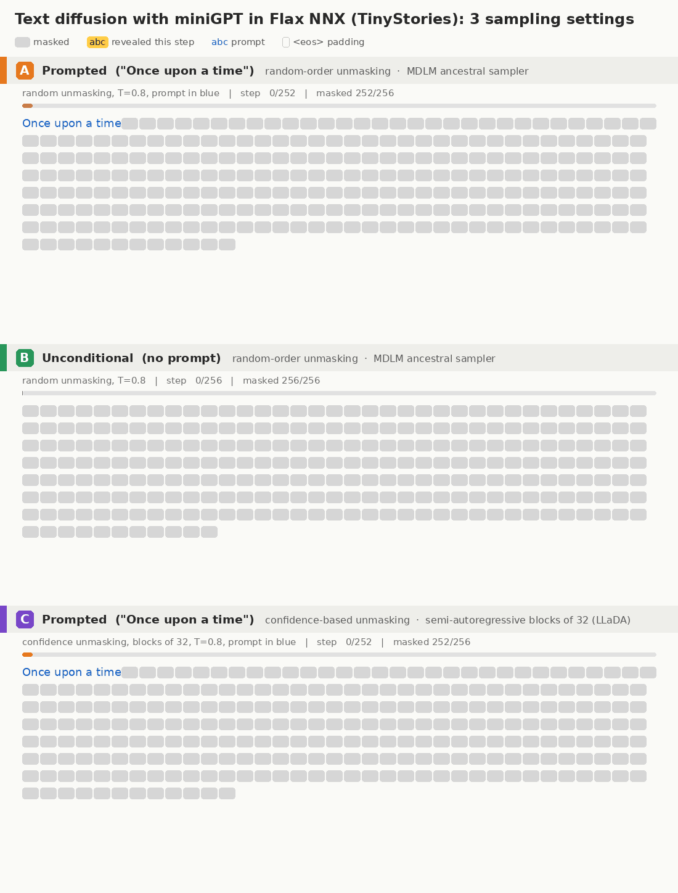
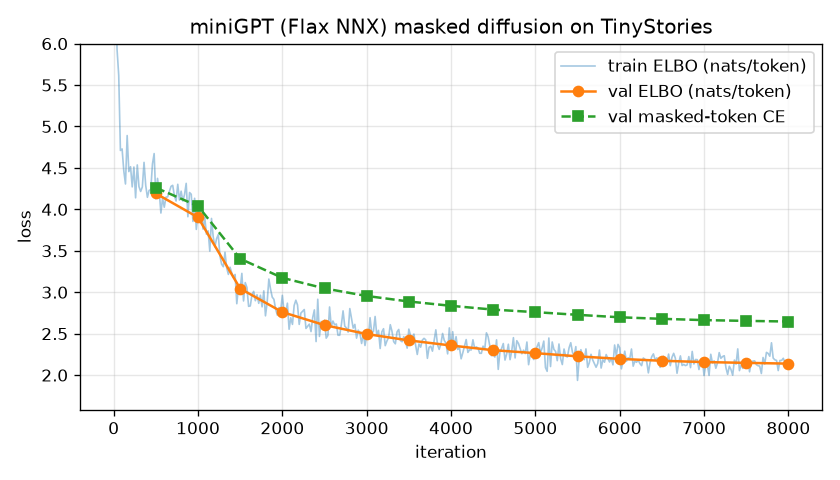

# 07.dLLM: a tiny text-diffusion model (miniGPT in Flax NNX) trained on TinyStories

A JAX / [Flax NNX](https://flax.readthedocs.io) / [Optax](https://optax.readthedocs.io) implementation
of a **masked discrete diffusion language model** (the MDLM / LLaDA recipe). The denoiser is the
**miniGPT** built in [01.miniGPT](../01.miniGPT/); the only change is to remove the causal mask, so
attention is bidirectional. The model is trained on
[TinyStories](https://huggingface.co/datasets/roneneldan/TinyStories).



Generation starts from a fully masked 256-token canvas and ends with a finished story, revealing one token per step:

- **A**: prompted with "Once upon a time", random-order unmasking
- **B**: unconditional (no prompt), random-order unmasking
- **C**: prompted, confidence-based unmasking with semi-autoregressive blocks of 32 (LLaDA-style)

## How it works

| | Autoregressive miniGPT (01) | This model (masked diffusion) |
|---|---|---|
| Attention | causal (`mask=causal_attention_mask(T)`) | **bidirectional** (`mask=None`) |
| Corruption | none | each token → `<mask>` with prob. `t ~ U(0,1)` |
| Training loss | next-token CE | `(1/t) · CE on masked tokens` (continuous-time ELBO) |
| Generation | left → right, 1 token / step | start from all `<mask>`, reveal ~`L/steps` tokens per step, in any order |

**Sampling.** We start from a fully masked 256-token canvas. At each step the model predicts
every masked position. We then commit either the most confident predictions (`--strategy confidence`,
as in LLaDA) or a random subset (`--strategy random`, the vanilla MDLM sampler). Training stories are
right-padded with `<eos>`, so the model also decides *where the story ends* (the small outlined boxes in
the GIF).

**miniGPT config** (the same model as 01.miniGPT): 4 transformer blocks, 8 heads, 256-d embeddings,
256-d feed-forward, 256 context. It uses `TokenAndPositionEmbedding` (learned positions), **post**-LayerNorm
blocks built on `nnx.MultiHeadAttention`, a ReLU MLP, and an untied `nnx.Linear` output layer, for
~5.8M params in total.

**Tokenizer.** We use GPT-2 BPE (via `tiktoken`), remapped to the 8,189 most frequent TinyStories
tokens plus 3 special tokens (`<eos>`, `<mask>`, `<unk>`). This covers 99.8% of tokens and makes the
softmax ~6× cheaper.

## Files

| File | Purpose |
|---|---|
| [`model.py`](model.py) | miniGPT (bidirectional) in Flax NNX |
| [`diffusion.py`](diffusion.py) | forward masking process, ELBO loss, jitted iterative-unmasking sampler |
| [`data.py`](data.py) | TinyStories download/tokenization, compact tokenizer |
| [`train.py`](train.py) | Grain data pipeline, Optax AdamW + warmup/cosine schedule, training loop, eval |
| [`checkpoint.py`](checkpoint.py) | Orbax save / restore of params and optimizer state |
| [`visualize.py`](visualize.py) | sample, then render the denoising trajectory as a GIF |
| [`plot_loss.py`](plot_loss.py) | training / validation curves |
| [`stack_gifs.py`](stack_gifs.py) | stack the three GIFs into one labelled comparison GIF |

## Usage

```bash
pip install jax flax optax grain orbax-checkpoint tiktoken pyarrow numpy pillow matplotlib huggingface_hub

python data.py                       # -> data/{train,val}.bin, data/vocab.json
python train.py                      # -> out/ckpt/, out/ckpt.json, out/log.jsonl
python plot_loss.py                  # -> assets/loss.png

# GIFs (default: random-order unmasking, 256 steps = 1 token / step)
python visualize.py --prompt "Once upon a time" --seed 3 --out assets/diffusion_prompt.gif
python visualize.py --seed 2 --out assets/diffusion_uncond.gif
python visualize.py --prompt "Once upon a time" --strategy confidence --block_len 32 --seed 1 \
    --out assets/diffusion_block_confidence.gif
python stack_gifs.py                 # -> assets/diffusion_stacked.gif (A/B/C comparison)
```

GIF legend: grey box = `<mask>`, yellow = tokens revealed at this step, blue = prompt,
outlined box = `<eos>` padding.

## Results

Trained on CPU (JAX/XLA, 48 cores, fp32) for 8,000 iterations × 64 stories × 256 tokens (~131M
tokens). That took ~1h43m at ~0.77 s/iter, using the first of the 4 train shards (≈ 530k stories).
Optimizer: AdamW (β = 0.9, 0.95; weight decay 0.1 on matrices / embeddings), gradient clipping at 1.0,
LR warmup to 1e-3 over 200 iterations followed by cosine decay to 1e-4.

| | value |
|---|---|
| params | **5.8M** |
| final val ELBO | **2.14 nats/token** (perplexity upper bound ≤ 8.5) |
| final val masked-token CE | **2.65** |



### Sampler matters

| sampler | behaviour |
|---|---|
| `random` (MDLM ancestral, default) | diverse, full-length stories; occasional local incoherence |
| `confidence`, whole sequence | **collapses to ~55–65-token stories**: trailing `<eos>` padding is the most confident prediction, so it is committed first and squeezes the story |
| `confidence` + `--block_len 32` (LLaDA semi-AR) | fluent and long, but repetitive / low diversity ("Lily … her toy car") |

Sample (random unmasking, prompt "Once upon a time"):

> Once upon a time, there was a little girl named Lily. She loved to play on her shelf, put it on her
> table and her write and draw around them. … Lily was so happy and her mom found her toys and play
> together. … The girl was very happy and hugged her because it was warm. …
