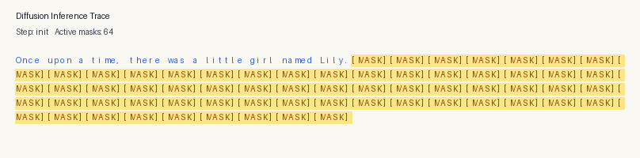

# micro-dllm (JAX / Flax NNX)

This repo trains a text diffusion language model (micro-dLLM) based on [mercury's training and inference](https://arxiv.org/abs/2506.17298) approach using the **JAX / Flax NNX API**, the **MiniGPT** architecture from [Train a miniGPT language model with JAX](https://docs.jaxstack.ai/en/latest/JAX_for_LLM_pretraining.html), and the **GPT-2** tokenizer (`tiktoken`). This is adapted from [micro-dllm](https://github.com/SwekeR-463/micro-dllm).

[](./artifacts/media/diffusion_trace.mp4)

## What This Implements

- Forward corruption with `[MASK]` tokens over random timesteps `t in [1..T]`
- Time-conditioned `MiniGPT` Transformer denoiser (`TokenAndPositionEmbedding` + `timestep_emb` + `TransformerBlock`s in `flax.nnx`)
- Full-sequence denoising objective (predict clean `x0` from noisy `x_t` on masked positions using `optax.softmax_cross_entropy_with_integer_labels`)
- Reverse denoising at inference (`t = T -> 1`, plus final `t=0` pass)
- Confidence-based remasking for iterative refinement
- GIF / MP4 trace output for denoising steps

## Architecture Details

- Framework: JAX + Flax NNX (`flax.nnx`) + Optax (`optax`)
- Parallelism: `jax.sharding.Mesh`, `NamedSharding`, `PartitionSpec`, and `nnx.with_partitioning`
- Tokenization: GPT-2 BPE tokenizer (`tiktoken.get_encoding("gpt2")`) + `[MASK]` special token (`vocab_size = 50258`, `mask_token_id = 50257`)
- Context length: `maxlen = block_size = 256` tokens
- Diffusion steps: `T = 100`
- Layers: `num_transformer_blocks = 4`
- Attention heads: `num_heads = 8`
- Embedding dimension: `embed_dim = 256`
- Feed-forward dimension: `feed_forward_dim = 256`
- Attention type: bidirectional (`mask=None`)
- Positional scheme: learned positional embeddings (`TokenAndPositionEmbedding` with `nnx.Embed`)
- Normalization: `nnx.LayerNorm`
- Timestep conditioning: learned embedding `nnx.Embed(T + 1, embed_dim)`

## Training

```bash
python3 train.py
```

Checkpoints are saved to `artifacts/models/` during training and at the end.

At the end of training, `train.py` prints a final validation metrics block with:

- `Perplexity` (derived from masked validation cross-entropy)
- `Masked reconstruction accuracy` (accuracy on corrupted positions only)
- `Entropy per timestep` (masked-token predictive entropy across diffusion timesteps)
- `Reverse-step token change rate` (fraction of generated tokens that change between reverse steps)
- `Distinct-2 diversity` (unique generated bigrams / total generated bigrams, prompt excluded)

## Inference + Visualizer

```bash
python3 inference.py \
  --checkpoint artifacts/models/minigpt_tinystories_ckpt \
  --prompt "Once upon a time" \
  --gen-len 64 \
  --temperature 0.0 \
  --viz-gif artifacts/media/diffusion_trace.gif \
  --viz-video artifacts/media/diffusion_trace.mp4 \
  --trace-every 5 \
  --gif-frame-ms 180
```
