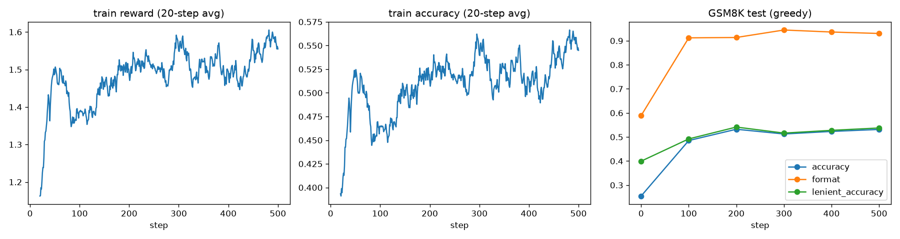

# Teaching Gemma3-1B math reasoning with GRPO (JAX / Flax NNX)

This tutorial fine-tunes **Gemma3-1B-IT** on **GSM8K** grade-school math word problems with
**GRPO** ([Group Relative Policy Optimization](https://arxiv.org/abs/2402.03300)), the RL algorithm behind DeepSeek-R1-style reasoning training.
The base model is frozen and only [LoRA](https://arxiv.org/abs/2106.09685) adapters are trained, all in bfloat16.

Only the Gemma3 model definition and checkpoint loader come from [Tunix](https://github.com/google/tunix) 0.1.7 (`tunix.models.gemma3`).
Everything else is written from scratch in [`train_grpo.py`](./train_grpo.py) with plain JAX + Flax NNX + Optax:
the LoRA adapters, the KV-cache sampler, reward functions, group-relative advantages, the clipped policy-gradient loss with KL penalty, the training loop, and evaluation.
No Hugging Face libraries are used: the model and dataset come from Kaggle (`kagglehub`), and the tokenizer is the Gemma SentencePiece model.



## Results

Greedy decoding on the full GSM8K test set (1319 questions), zero-shot, single TPU v6e chip:

| | strict accuracy | format | lenient accuracy |
|---|---|---|---|
| Gemma3-1B-IT (before) | 25.5% | 58.9% | 40.0% |
| + GRPO with LoRA, 500 steps (~1 epoch, ~1 h) | **53.2%** | 93.0% | 53.8% |

- **strict accuracy**: the response follows `<reasoning>…</reasoning><answer>…</answer>` *and* the answer is correct (this is what the reward optimizes).
- **format**: the response follows the required format.
- **lenient accuracy**: the last number anywhere in the response is correct, ignoring the format. It separates "learned the format" from "got better at math".

Most of the gain comes in the first ~100–200 steps. Lenient accuracy also rises (40.0% → 53.8%), so the model does not *only* learn the format:
committing to a single final answer at the end helps. After that, test accuracy stays at 51–53%.
For comparison, an earlier full-parameter fine-tune (fp32 master weights, lr 1e-6) reached the same 53.2%.

**Learning rate matters.** With lr 1e-5, LoRA learned no faster (46.4% vs 48.5% test accuracy at step 100) and collapsed after ~200 steps. KL rose from ~0.05 to 2–4, format compliance on the training batches fell from 93% to ~70%, and samples degenerated into incoherent text.
lr 3e-6 (the same as Tunix's GRPO example for rank 64 / alpha 64) stays stable at KL ≈ 0.03 for the whole run.
A few isolated single-step spikes in KL and grad norm (e.g. step 378) are absorbed by gradient clipping.

## How GRPO works

For every question in a batch:

1. **Rollout**: sample a *group* of `G = 8` completions from the current policy (temperature 0.9, top-k 50).
2. **Reward**: score each completion with rules, no reward model needed:
   `+0.5` if it matches the `<reasoning>…</reasoning><answer>…</answer>` format, `+2.0` if the answer is numerically correct.
3. **Advantage**: normalize each reward within its group, `A_i = (r_i − mean(r)) / (std(r) + ε)`.
   The group mean acts as the baseline, so GRPO needs no value network (unlike PPO).
   Groups where every sample gets the same reward produce zero advantage, so they contribute no policy-gradient signal.
4. **Policy update**: minimize, averaged over the tokens of each completion and then over completions,

   ```
   L = −[ min(ρ_t A, clip(ρ_t, 1−ε, 1+ε) A) − β · KL_t ]
   ρ_t  = π_θ(o_t | q, o_<t) / π_old(o_t | q, o_<t)
   KL_t = exp(ref_t − logp_t) − (ref_t − logp_t) − 1    (k3 estimator, always ≥ 0)
   ```

   where `ref` is the frozen initial model. With one update per batch (`--num_iterations 1`), `π_old = stop_gradient(π_θ)`, so `ρ_t = 1` and
   the gradient reduces to the REINFORCE-style `−A ∇log π_θ` plus the KL term. `--num_iterations > 1` reuses each batch for several clipped PPO updates.

## Implementation notes

- **Model**: `tunix.models.gemma3.params.create_model_from_checkpoint` loads the Kaggle Flax checkpoint into Tunix's NNX `Gemma3`.
  In Tunix 0.1.7, `Gemma3.__call__` always projects every position onto the 262k-token vocabulary.
  So `hidden_states()` reruns Tunix's embedder, decoder layers, and final norm without the LM head, and the code projects only the completion positions.
- **LoRA (rank 64) on every projection**: the attention projections `q_einsum`, `kv_einsum`, and `attn_vec_einsum` (Tunix `Einsum` modules) and the MLP `gate_proj`, `up_proj`, and `down_proj` (`nnx.Linear`).
  The MLP layers are wrapped with Flax's `nnx.LoRA(base_module=...)`.
  The attention layers use a small `LoRAEinsum` wrapper that derives the low-rank einsums from the base einsum string (e.g. `BTD,NDH->BTNH` becomes `BTD,Dr->BTr` then `BTr,rNH->BTNH`).
  `B` starts at zero, so training starts exactly at the base model. `nnx.split(model, nnx.LoRAParam, ...)` separates the ~50M trainable adapter params from the frozen 1B base.
- **Reference model for free**: the KL reference is the base model, i.e. the same graph with all-zero LoRA params. No second copy of the weights is needed.
- **bfloat16 everywhere**: base weights, LoRA weights, activations, gradients, and Adam state are all bf16.
  The exceptions are the final log-softmax over the vocabulary and the scalar loss math, which run in fp32 (as Tunix's own `compute_final_logits` does).
  A bf16 log-softmax over 262k entries is too coarse for the policy ratio.
- **Stochastic rounding**: an Adam step is ~`lr` in size, often far below the bf16 spacing of a weight (~0.4% of its magnitude).
  With plain round-to-nearest, ~98% of the updates were silently dropped in a full-fine-tuning test at lr 1e-6.
  `apply_updates_stochastic` instead rounds `w + Δw` up or down at random, with probability proportional to proximity, so `E[round(w + Δw)] = w + Δw` and small updates survive on average.
- **No rematerialization**: all activations are kept for the backward pass. Gradients are accumulated over micro-batches of 8 sequences with `lax.scan`.
  XLA's compiled memory analysis gives ~16 GB peak for micro-batch 8 and ~29 GB for 16, at the worst case of 256 prompt + 512 completion tokens.
- **Sampler**: prompts are left-padded so every completion starts at the same KV-cache slot. Generation runs as a single jitted `lax.while_loop` that stops as soon as every sequence has emitted `<end_of_turn>`/`<eos>`.
- **Shape bucketing**: the completion length used for training is rounded up to a multiple of 128 tokens, which bounds the number of recompilations.
- **bf16 noise in the KL**: two differently compiled bf16 forward passes of the *same* weights disagree by ~0.02 nats per token on average (vs. an fp32 forward), so the reported KL has a noise floor of ~1e-3.

## Usage

```bash
pip install -r requirements.txt
# Kaggle credentials (KAGGLE_USERNAME / KAGGLE_KEY) are needed to download the model; accept the Gemma license on Kaggle first.
python train_grpo.py                  # defaults: 500 steps, 16 questions x 8 samples per step
python train_grpo.py --help           # all hyperparameters
```

Outputs in `artifacts/`: `metrics.jsonl` (per-step training metrics + evals), `training_curves.png`, and the trained LoRA adapters as an Orbax checkpoint (`gemma3_1b_grpo_lora/`, ~70 MB).

Key defaults: LoRA rank 64, learning rate 3e-6 (20 warmup steps, cosine decay), AdamW (β2 = 0.99), grad-norm clip 1.0, β = 0.04, ε = 0.2, max 512 new tokens.
One step (128 rollouts + update) takes ~6 s on a single TPU v6e chip.
